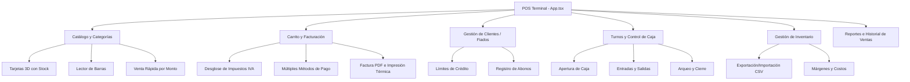

<div align="center">

# 🛒 Tienda Mixta La Esquinita · Sistema POS Profesional

**Sistema Integral de Punto de Venta (POS), Gestión de Inventario, Control de Caja, Cartera de Clientes y Facturación Electrónica / PDF para Tiendas y Comercios.**

[](https://react.dev/)
[](https://www.typescriptlang.org/)
[](https://vitejs.dev/)
[](https://tailwindcss.com/)
[](LICENSE)

[Características](#-características-principales) •
[Estructura](#-arquitectura-del-proyecto) •
[Instalación](#-instalación-y-despliegue) •
[Módulos](#-módulos-del-sistema) •
[Tecnologías](#-tecnologías-utilizadas)

</div>

---

## 📌 Descripción General

**Tienda Mixta La Esquinita - Sistema POS** es una solución de Punto de Venta moderna, ágil y reactiva construida con **React 19**, **TypeScript** y **Tailwind CSS**. Diseñada específicamente para optimizar la operativa diaria de tiendas de abarrotes, minimarkets y comercios minoristas, ofreciendo un flujo de caja rápido, control de fiados/créditos, arqueo de turnos, escaneo de códigos de barra mediante cámara y generación de facturas térmicas (80mm) y reportes en PDF.

---

## ✨ Características Principales

### 💳 1. Terminal Punto de Venta (POS) Ágil
- **Catálogo Interactivo con Efecto 3D**: Tarjetas de productos visuales con perspectiva dinámica, indicador de stock en tiempo real, alertas de bajo inventario y precios en Pesos Colombianos (**COP**).
- **Múltiples Modos de Visualización**: Modo Cuadrícula Visual 3D, Modo Compacto y Modo Lista densa.
- **Carrito Lateral en Tiempo Real**: Ajuste instantáneo de cantidades, eliminación de ítems, cálculo automático de subtotal, descuentos globales o por ítem, e impuestos desagregados (IVA 19%, IVA 5%, Exento, ICO).
- **Acceso Rápido por Monto / Venta Express**: Permite registrar ventas directas ingresando solo el valor en pesos sin necesidad de crear un producto previo.
- **Barra de Favoritos y Chips de Búsqueda Rápida**: Accesos configurables a los productos de mayor rotación (Pan, Huevos, Leche, Cerveza, etc.).

### 📷 2. Lector de Códigos de Barra
- **Escaneo con Cámara en Vivo**: Integración nativa con `html5-qrcode` para lectura rápida de códigos EAN-13, EAN-8, Code-128 y QR.
- **Entrada Manual de Código de Barras**: Con soporte para lectores láser USB/Bluetooth con envío automático de `Enter`.
- **Feedback Auditivo**: Beep sónico sintetizado al detectar productos y agregarlos a la comanda.

### 💰 3. Arqueo y Control de Turnos de Caja (Cash Shifts)
- **Apertura de Turno**: Registro de base inicial de caja por cajero.
- **Control de Movimientos**: Registro detallado de entradas adicionales y egresos (pagos a proveedores, compras menores, gastos varios).
- **Arqueo y Cierre**: Comparativa automática entre el dinero esperado en sistema y el dinero físico contado, calculando sobrantes o faltantes con reporte imprimible.

### 👥 4. Cartera de Clientes y Gestión de "Fiados" (Créditos)
- **Directorio de Clientes**: Gestión de datos de contacto (Nombre, Cédula/NIT, Teléfono, Dirección).
- **Límite de Crédito y Saldo Pendiente**: Control de deudas activas con alertas visuales de cupo disponible o excedido.
- **Registro de Abonos / Pagos de Deuda**: Historial de abonos con soporte para efectivo, transferencias (Nequi, Daviplata) o tarjeta.

### 📦 5. Gestión Integral de Inventario
- **Control de Stock y Costos**: Registro de costo de compra, precio de venta, margen de ganancia porcentual y tasa de impuesto aplicable.
- **Importación y Exportación Masiva**: Soporte para carga y descarga en formato CSV para respaldos y sincronización con hojas de cálculo.
- **Ajustes Rápidos de Stock**: Actualización en lote de existencias y reabastecimiento en un solo clic.

### 🧾 6. Facturación y Comprobantes
- **Factura PDF Profesional**: Generación de facturas formales con `jsPDF` con desglose de impuestos, datos del negocio, cliente y forma de pago.
- **Tirilla Térmica POS (80mm)**: Formato optimizado para impresión directa en impresoras térmicas POS.
- **Múltiples Métodos de Pago**: Efectivo (con cálculo automático de cambio/vueltas), Nequi, Daviplata, Tarjeta Débito/Crédito y Crédito/Fiado.

### 📊 7. Reportes Financieros y Analítica
- **Métricas Clave**: Total de ventas, utilidad bruta, ticket promedio y margen operativo.
- **Desglose de Métodos de Pago**: Proporción de ventas en efectivo vs. transferencias electrónicas.
- **Top de Productos Más Vendidos**: Clasificación por volumen y valor monetario.

---

## 🗂️ Arquitectura del Proyecto

El código está estructurado de manera modular y escalable, separando componentes de presentación, modales de lógica de negocio, utilidades y tipos:

```
├── public/                      # Recursos estáticos y manifiestos
├── src/
│   ├── components/              # Componentes de la interfaz
│   │   ├── layout/              # Encabezado, navegación y barra rápida
│   │   │   ├── POSHeader.tsx
│   │   │   ├── CategoryNav.tsx
│   │   │   ├── QuickFavoritesBar.tsx
│   │   │   └── index.ts
│   │   ├── pos/                 # Cuadrícula de productos y carrito
│   │   │   ├── ProductGrid.tsx
│   │   │   ├── POSCartDrawer.tsx
│   │   │   └── index.ts
│   │   ├── modals/              # Ventanas modales del sistema
│   │   │   ├── AddProductModal.tsx
│   │   │   ├── BarcodeScannerModal.tsx
│   │   │   ├── CashShiftModal.tsx
│   │   │   ├── CustomerModal.tsx
│   │   │   ├── InventoryManagerModal.tsx
│   │   │   ├── ManageCategoriesModal.tsx
│   │   │   ├── ManageQuickFavoritesModal.tsx
│   │   │   ├── ManageQuickSearchModal.tsx
│   │   │   ├── PaymentModal.tsx
│   │   │   ├── QuickAmountModal.tsx
│   │   │   ├── ReceiptModal.tsx
│   │   │   ├── ReportsModal.tsx
│   │   │   ├── SalesHistoryModal.tsx
│   │   │   └── index.ts
│   │   ├── ui/                  # Primitivas visuales y tarjetas interactivas 3D
│   │   │   ├── card-7.tsx
│   │   │   ├── cards.tsx
│   │   │   └── index.ts
│   │   └── index.ts             # Exportación centralizada de componentes
│   ├── data/                    # Datos iniciales y catálogo semilla
│   │   └── initialData.ts
│   ├── lib/                     # Utilidades y generador de documentos
│   │   ├── pdfGenerator.ts      # Generador de facturas PDF con jsPDF
│   │   └── utils.ts             # Formateo de moneda (COP), URLs e imágenes
│   ├── types.ts                 # Definiciones de TypeScript e interfaces
│   ├── App.tsx                  # Controlador principal del estado del POS
│   ├── index.css                # Estilos globales y Tailwind CSS
│   └── main.tsx                 # Entrada de la aplicación React
├── .env.example                 # Variables de entorno de referencia
├── index.html                   # Documento HTML principal y metadatos
├── package.json                 # Dependencias y scripts del proyecto
├── tsconfig.json                # Configuración de compilación TypeScript
└── vite.config.ts               # Configuración del bundler Vite
```

---

## 🚀 Instalación y Despliegue

### Requisitos Previos
- **Node.js** v18.0 o superior
- **npm**, **pnpm** o **yarn**

### Pasos para Ejecutar Localmente

1. **Clonar el repositorio:**
   ```bash
   git clone https://github.com/Davidcastanom/sistema-pos2-main.git
   cd sistema-pos2-main
   ```

2. **Instalar las dependencias:**
   ```bash
   npm install
   ```

3. **Configurar variables de entorno (opcional):**
   ```bash
   cp .env.example .env
   ```

4. **Iniciar el servidor de desarrollo:**
   ```bash
   npm run dev
   ```
   La aplicación estará disponible en `http://localhost:3000`.

5. **Compilar para producción:**
   ```bash
   npm run build
   ```

6. **Verificar tipos y código:**
   ```bash
   npm run lint
   ```

---

## 🛠️ Tecnologías Utilizadas

| Categoría | Tecnología / Librería | Uso Principal |
|---|---|---|
| **Frontend Core** | [React 19](https://react.dev/) | Biblioteca principal de interfaz de usuario reactiva |
| **Lenguaje** | [TypeScript 5.8](https://www.typescriptlang.org/) | Tipado estático estricto y modelos de datos |
| **Empaquetador** | [Vite 6](https://vitejs.dev/) | Build tool ultrarrápido con Hot Module Replacement |
| **Estilos** | [Tailwind CSS 4](https://tailwindcss.com/) | Sistema de diseño utility-first y temas personalizados |
| **Iconografía** | [Lucide React](https://lucide.dev/) | Set de íconos vectoriales modernos |
| **Animaciones** | [Motion](https://motion.dev/) & [Canvas Confetti](https://www.npmjs.com/package/canvas-confetti) | Transiciones suaves y celebraciones al completar ventas |
| **Código de Barras** | [HTML5-QRCode](https://scanapp.org/html5-qrcode-docs/) | Reconocimiento de códigos de barra por cámara en tiempo real |
| **Documentos** | [jsPDF](https://github.com/parallax/jsPDF) | Motor de renderizado y descarga de facturas en PDF |
| **Persistencia** | `localStorage` API | Almacenamiento local seguro offline-first |

---

## 📦 Módulos del Sistema



---

## 📄 Licencia

Este proyecto se encuentra bajo la Licencia **MIT**. Consulta el archivo `LICENSE` para obtener más detalles.

---

<div align="center">

Desarrollado con ❤️ para **Tienda Mixta La Esquinita**

</div>
